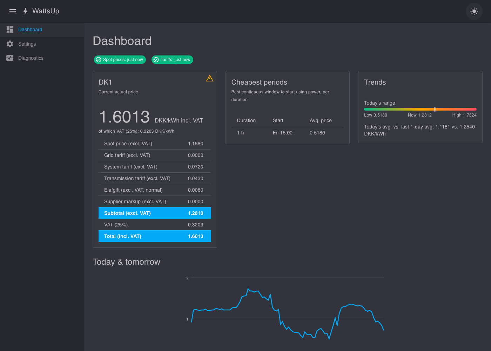
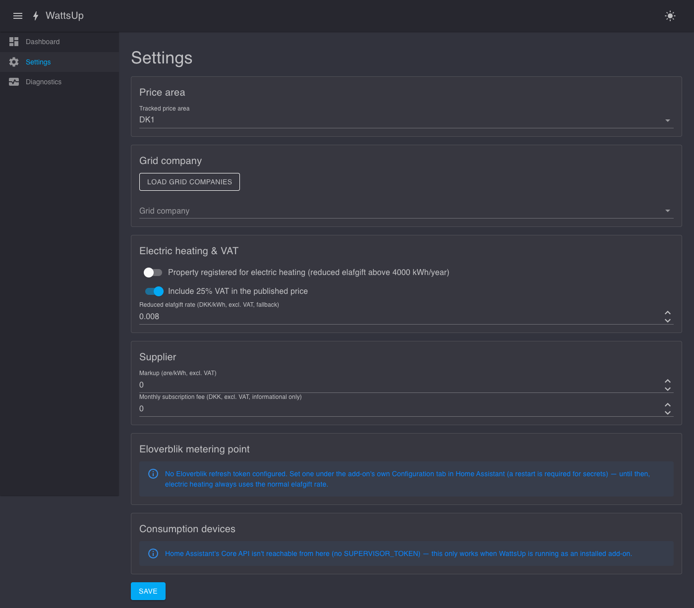

# WattsUp

A Home Assistant add-on that tracks Danish (DK1/DK2) electricity spot prices, resolves your grid
company's tariffs plus the nationwide system tariff, transmission tariff and elafgift, adds your
supplier's markup, and publishes the resulting actual current price to Home Assistant over MQTT —
configured through the add-on's own options for secrets and a MudBlazor web UI (via ingress) for
everything else.

There's also a public, installable browser-only demo with no installation and no Home Assistant
required — see [Public web demo](#public-web-demo) below.

See [`wattsup/DOCS.md`](wattsup/DOCS.md) for installation and usage,
[`wattsup/CHANGELOG.md`](wattsup/CHANGELOG.md) for release notes, and [`BACKLOG.md`](BACKLOG.md)
for planned future work (a local price-prediction engine).

## Public web demo

**<https://ulfendk.github.io/WattsUp/>** — the same pricing/tariff logic and dashboard, built as a
standalone Blazor WebAssembly app (`wattsup/app/src/WattsUp.Wasm`) and published to GitHub Pages
by `.github/workflows/build.yml`'s `deploy-pages` job on every push to `main`. Installable as a PWA
("Add to Home Screen" / the browser's install prompt).

This build has **no server that handles requests for you** — no backend, no database, nothing
that sees who you are or what you enter. A few things follow from that:

- Any secrets you enter (an Eloverblik refresh token) are saved only in your browser's local
  storage, on the [Secrets](https://ulfendk.github.io/WattsUp/secrets) page — see that page for
  details. Nothing is ever sent to or stored by a WattsUp server, because none exists here.
- Price/tariff history is stored per-browser in IndexedDB, not a shared database — it's lost if you
  clear site data or switch browsers/devices, and isn't shared between visitors.
- There's no Home Assistant integration in this build (no MQTT publishing, no device consumption
  tracking) — install the real add-on for that.
- **Spot prices and grid tariffs are not fetched live from your browser** — turns out
  api.energidataservice.dk (a public, keyless, but not CORS-enabled API) can't be called directly
  from a browser at all. Instead, a scheduled GitHub Actions job
  (`.github/scripts/fetch_price_snapshot.py`) fetches that same public dataset server-side every 6
  hours and publishes it as static files alongside the site, which your browser then reads —
  same-origin, no CORS problem. This involves no personal data whatsoever (it's the same public
  dataset the real add-on polls); it just means prices can lag up to ~6h behind the real API,
  rather than being instant.
- Eloverblik's personal-data API may or may not allow being called directly from a browser (a CORS
  policy only eloverblik.dk controls); if it doesn't, metering-point/consumption features show a
  clear error instead of data.

## Screenshots

| Dashboard | Dashboard (dark) | Settings |
|---|---|---|
|  |  |  |

## Repository layout

- `wattsup/` - the Home Assistant add-on: `config.yaml`, `Dockerfile`, docs, translations, and the
  `app/` subfolder containing the .NET solution:
  - `app/src/WattsUp` - the Blazor Server app (the HA add-on itself). Its own source has to live
    inside the add-on folder because Docker's build context can't reach outside it.
  - `app/src/WattsUp.Core` - shared Razor Class Library: pricing/tariff domain logic, repository
    interfaces, and the Dashboard/Settings/Diagnostics UI, referenced by both `WattsUp` and
    `WattsUp.Wasm` so neither duplicates the other. Also has to live inside the add-on folder, for
    the same Docker build-context reason (see its `COPY` line in `wattsup/Dockerfile`).
  - `app/src/WattsUp.Wasm` - the standalone Blazor WebAssembly host for the
    [public web demo](#public-web-demo). Lives alongside the others for solution/build
    convenience only — the Docker build never copies it in.
  - `app/src/WattsUp.Tests` - the test suite (targets `WattsUp`, which pulls in `WattsUp.Core`
    transitively).
- `repository.yaml` - marks this repo as a Home Assistant add-on repository.
- `.devcontainer.json` / `.vscode/tasks.json` - the local dev environment below.

## Local development

### Fast inner loop: `dotnet run`

For UI/data logic changes, run the app directly - no Home Assistant needed:

```sh
dotnet run --project wattsup/app/src/WattsUp
```

Runs at `http://localhost:8099` with no ingress in the loop — HA's `X-Ingress-Path` header is only
sent when actually proxied through Supervisor, so `IngressPathBaseMiddleware` is a no-op locally.

Run the tests with `dotnet test wattsup/app/WattsUp.slnx` (or from within `wattsup/app`).

For the [public web demo](#public-web-demo) instead:

```sh
dotnet run --project wattsup/app/src/WattsUp.Wasm
```

Runs at the dev-server URL `dotnet run` prints (not `:8099` — that's the Server host above). Data
is stored in your browser's IndexedDB/localStorage, same as the deployed site.

### Full loop: Supervisor dev container

Ingress path handling, MQTT discovery, and backups can only really be verified against a real
Supervisor + Home Assistant instance. This repo is set up for Home Assistant's official dev
container, which gives you exactly that with no physical hardware:

**Prerequisites:** VS Code, Docker (or Podman with its Docker-compatible socket), the Dev
Containers extension.

1. Open this folder in VS Code, then **Rebuild and Reopen in Container** when prompted.
2. Run the **Start Home Assistant** task (Terminal → Run Task) - it bootstraps Supervisor and Home
   Assistant inside the container.
3. Open <http://localhost:7123/> and complete onboarding. Because `wattsup/` sits at the repo
   root, it shows up automatically under **Settings → Add-ons → Local add-ons** (also labelled
   "Local apps" in newer Home Assistant versions) - install it there.
4. Iterate: edit code, then run the **Rebuild and Start App** task (pick `wattsup` when prompted)
   to rebuild the container from the Dockerfile and tail its logs. This is also how you force a
   local Dockerfile build even after `config.yaml` has a published `image:` set.
5. For MQTT testing, also install the Mosquitto broker add-on inside the dev container.

Reserve an install on a real HA instance for a final performance/footprint check before calling a
change done - the dev container won't reflect the target hardware's real performance.

### Building the container image directly

Outside the dev container, you can build (and, with Podman, run) the image directly:

```sh
cd wattsup
podman build -t wattsup:local .
```

## Releasing

`wattsup/config.yaml` has no `image:` field by default, so Supervisor always builds the add-on
from the `Dockerfile` locally - this is what you want during development, since once `image:` IS
set, Supervisor always tries to *pull* that tag and does **not** fall back to a local build if the
pull fails.

To switch to prebuilt images once you're happy with a release:

1. Bump `version` in `wattsup/config.yaml` (and add a `wattsup/CHANGELOG.md` entry).
2. Push a matching `vX.Y.Z` git tag - `.github/workflows/build.yml` builds and pushes a multi-arch
   image to GHCR.
3. In GitHub, make the resulting `ghcr.io/ulfendk/wattsup/wattsup` package public (Packages tab →
   package settings → Change visibility) - Supervisor pulls anonymously, so a private package
   403s.
4. Add `image: ghcr.io/ulfendk/wattsup/wattsup` back to `wattsup/config.yaml` and push.
