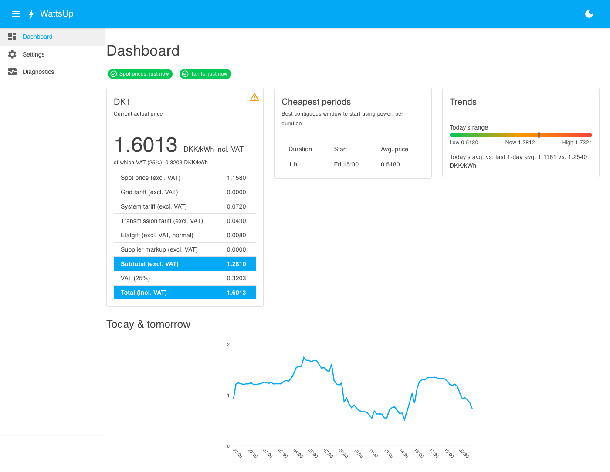

# WattsUp

WattsUp tracks Danish electricity prices (DK1/DK2 day-ahead spot prices), resolves your grid
company's tariffs and the nationwide charges (system tariff, transmission tariff, elafgift), adds
your supplier's markup, and publishes the resulting **actual** current price to Home Assistant over
MQTT — with a web UI (via ingress) for configuration and a live dashboard.

## Installation

1. Add this repository to your Home Assistant add-on store and install **WattsUp**.
2. Before starting, open the add-on's **Configuration** tab and set any secrets you need:
   - **Eloverblik refresh token** — optional, generated at [eloverblik.dk](https://eloverblik.dk)
     under *Data access → Create token*. Enables the electric-heating annual-threshold calculation.
   - **MQTT host/port/username/password** — only needed if you want to point at a broker other than
     the one Home Assistant's Supervisor already knows about (e.g. the Mosquitto broker add-on,
     which is auto-discovered and needs no configuration here).
   - **Carnot API key** — reserved for a future price-prediction feature; leave empty.
3. Start the add-on and open its web UI (via the sidebar panel, or ingress).
4. On the **Settings** page: pick the single price area you're on (DK1 or DK2), load and select your
   grid company, and set your supplier's markup/subscription fee (all excl. VAT — the VAT rate and
   total are shown separately). Everything here takes effect immediately — no restart needed.

## What gets published to MQTT

WattsUp publishes a `sensor.wattsup_price_<area>` entity (auto-created via MQTT Discovery, for
whichever single price area is currently tracked — switching areas removes the old sensor) with:
- **State**: the current all-in price in DKK/kWh (spot + grid tariff + system tariff +
  transmission tariff + elafgift + your markup, with VAT applied if enabled).
- **Attributes**: the full cost breakdown, whether the reduced elafgift rate is in effect, and
  whether every input resolved from live data or fell back to a cached/seeded value.

A `sensor.wattsup_diagnostics` entity reports poller staleness and which MQTT broker source is
active. Subscription-style fees (grid "abo" line items, your supplier's monthly fee) are shown in
the UI but are never added to the published per-kWh price.

## Consumption devices

On the **Settings** page, if WattsUp is running as an installed add-on, you can load and select HA
power/energy sensor entities (e.g. an EV charger or dryer's own energy monitor) to track. WattsUp
polls their state via Home Assistant's own REST API (not MQTT) every 15 minutes and calculates the
DKK cost of what they used, on an hourly basis and for the current in-progress hour.

## Electric heating

If your property is registered for electric heating, toggle it on in Settings. Below 4000 kWh of
consumption per calendar year the normal elafgift rate applies; above it, the reduced rate applies.

For a day that's already over, WattsUp blends that day's normal/reduced split into one effective
rate applied across its 24 hours, rather than a hard cutover mid-day (Eloverblik only ever publishes
a daily consumption total, with at least a day's settlement delay, so placing the crossing point
hour-by-hour isn't meaningful anyway). If you configure the optional "elvarme" secondary metering
point in Settings, this uses Eloverblik's own distributed daily allowance figures; otherwise it's
approximated from your own year-to-date consumption total. Without an Eloverblik connection, the
normal rate is always used and this is shown explicitly in the UI.

**Auto-filling supplier/grid company from your metering point**: investigated for this release —
Eloverblik's Customer API is scoped to consumption data (metering point ID, type, and address) and
doesn't expose your grid company or electricity supplier's identity, so this can't be auto-filled
today. Both remain manually entered in Settings.

## Price predictions

Not implemented in this version. The architecture reserves a Carnot.dk API key field and an
extension seam for a future forecast provider, but no prediction data is fetched or published yet.

## Troubleshooting

Check the **Diagnostics** page in the web UI first — it shows when each background poller last
succeeded, the active MQTT broker (and its source), and any warnings (e.g. a nationwide charge code
that stopped resolving in the underlying dataset). The add-on's own log (Home Assistant → Add-ons →
WattsUp → Log) has more detail; set **Log level** to `debug` for verbose HTTP/MQTT tracing.
